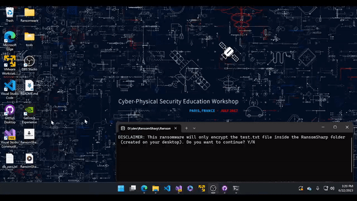

  

  # RansomSharp

  A didactic Ransomware for educational purposes.

  

  > "Education is the most powerful weapon you can use to change the world." - Nelson Mandela

  <!-- Image or GIF demonstrating the operation of the project -->

  

  ## About Ransomware

  Ransomware is a type of malware that encrypts files on a system and demands a ransom (usually in cryptocurrency) to unlock and recover the files. It is important to note that RansomSharp was created for educational purposes only and should not be misused. The use of ransomware outside of its educational purpose, i.e. for profit or harmful to others is `ILLEGAL` and `UNETHICAL`.

  ## Features

  - Encrypts the 'test.txt' file inside the 'RansomSharp' folder created on the user's desktop.
  - Change the system wallpaper to a custom wallpaper.
  - Generates a random encryption key for each execution.
  - Requires a ransom, represented by the encryption key, to decrypt the files.
  - Provides the option to enter the correct encryption key to recover the files.

  ## How it works

  RansomSharp is developed in C# and uses the Advanced Encryption Standard (AES) symmetric encryption algorithm to encrypt and decrypt the file `test.txt`. The program generates a random encryption key, encrypts the contents of the file, and stores the key in a second file called `dontworry.txt`.

  In addition, the program downloads a custom wallpaper from a given URL and sets it as system wallpaper.

When the program runs, it displays a message to the user stating that their files have been encrypted and requests the payment of a ransom to recover them. If the user enters the correct encryption key, the program decrypts the file `test.txt`, replacing the encrypted content with the original content.

  It is important to note that the program is not persistent and does not propagate automatically. It is only a demonstration for educational purposes.

  ## Installation

  1. Clone this repository on your local machine.
  2. Make sure you have the .NET Framework installed on your machine.
  3. Open the 'RansomSharp.sln' file in your preferred IDE.
  4. Build and run the project.

  ## Contribution

Contributions are welcome! Feel free to open an issue to report bugs, suggest new features, or submit a pull request with improvements to the project.

  ## License

This project is licensed under the terms of the [GPLv3](LICENSE). Read the LICENSE file for more information.

**Note:** This project is provided for educational purposes only. I am not responsible for any misuse of the code.

## Credits

  Developed by [Lucas Lobo(H4x0rModdz)](https://github.com/H4x0rModdz)

